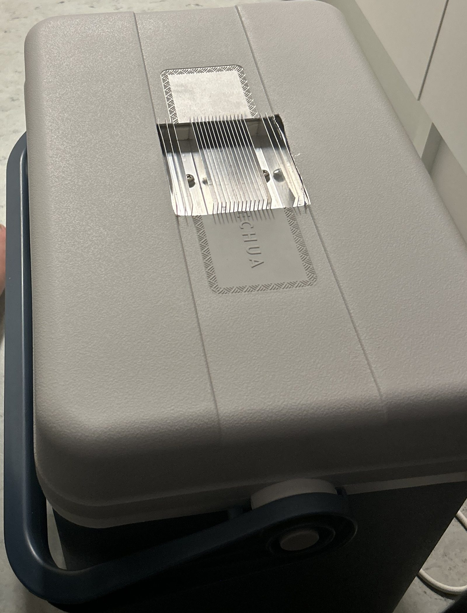
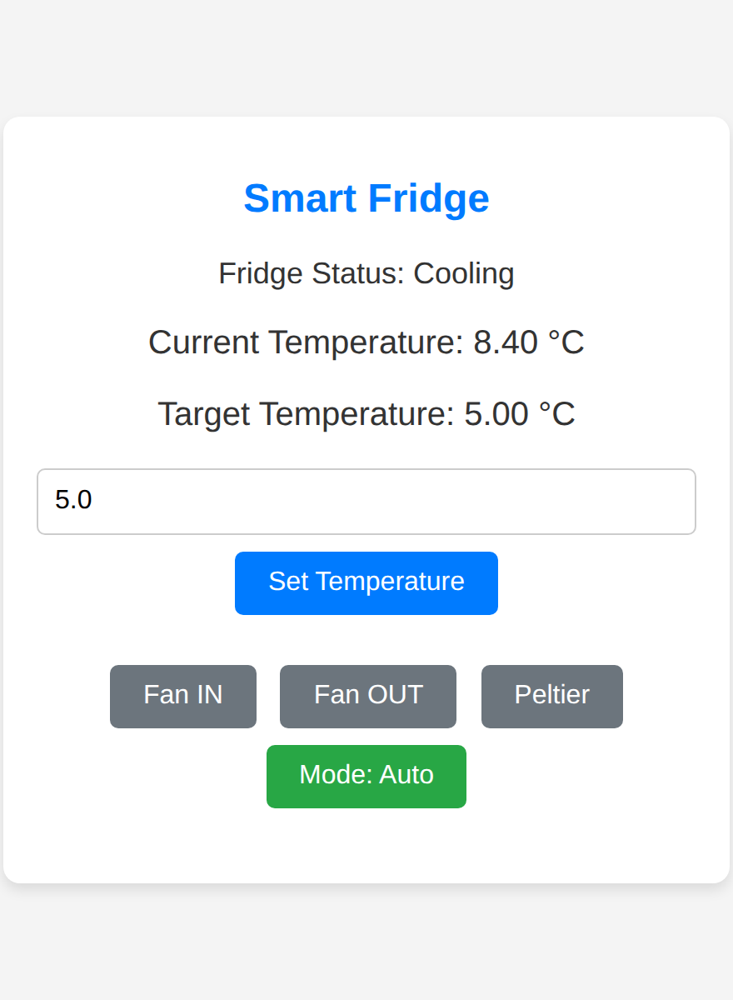
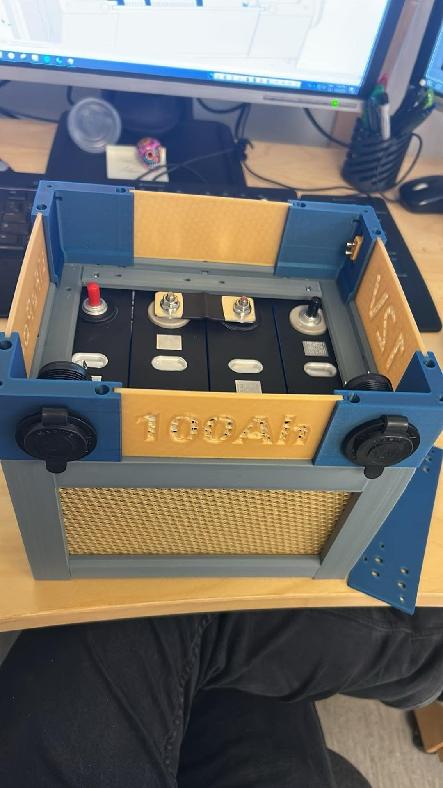
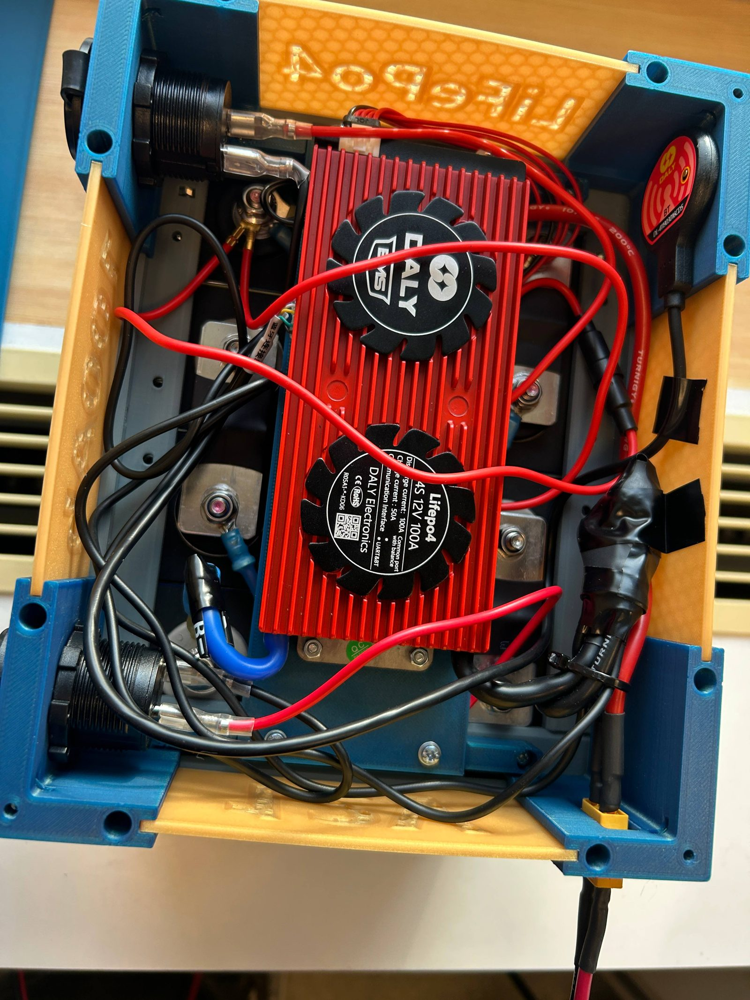
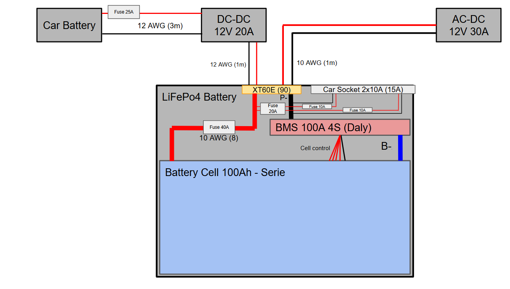
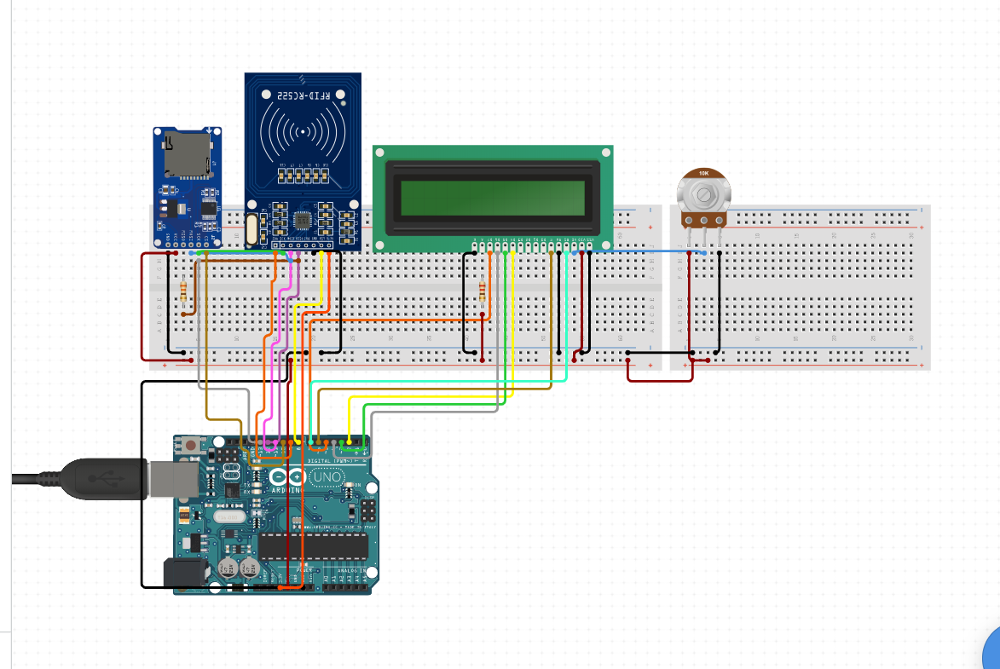

# Electronics builds — ESP32 & Arduino

A few small electronics projects from my studies and hobby time. Each one is here
because it taught me something specific — how far a Peltier module actually gets you,
how to stand up a web UI on an ESP32, how to build a safe LiFePO4 pack — and the
write-ups stay honest about what worked and what didn't.

## Peltier car fridge (2025)

An attempt to turn a cool-box into an active fridge: a Peltier module, a two-fan heat
exchanger and an ESP32. The ESP32 brings up its own Wi-Fi hotspot and serves a control
page — you connect from your phone, set a target temperature and watch the reading live,
no app to install. Control is plain on/off: in auto mode the Peltier and fans switch on
whenever the box is above target, and the outer fan keeps running for 20 s after each
cycle to clear the heat still sitting in the exchanger.

| | |
|---|---|
| Controller | ESP32 DevKit |
| Cooling | TEC1-12705 Peltier module, heat exchanger, two fans |
| Sensors | DS18B20 inside the box (a second sensor on the exchanger was wired but left disabled in the final firmware) |
| Switching | Logic-level MOSFETs (IRLB8721), driven straight from the ESP32's 3.3 V pins — on/off, no PWM |
| Interface | ESP32 Wi-Fi hotspot + web server — live temperature, setpoint, and a manual override mode |
| Box | ~30 L cool-box |

*Firmware: [`Car_Fridge.ino`](firmware/car-fridge/Car_Fridge.ino) — Wi-Fi access point,
web server and the on/off control loop.*

It didn't really work — and that was the useful part. With the insulation as built, the
box dropped only about 2 °C in 30 minutes, and only within ~5 cm of the cold side; heat
was leaking back in about as fast as the Peltier pulled it out. The goal had been to work
out the principle, get a feel for Wi-Fi on the ESP32, and see how efficient a Peltier
module really is — for a poorly-insulated box, the answer is "not very" — so once that
was clear I shelved it. What I'd change: much better insulation and a larger cold-side
plate, or drop Peltier altogether for a compressor if real cooling were the point.

## 100 Ah 12 V LiFePO4 power bank (2025)

A 12 V battery bank I assembled as a portable backup power source, built around safe
fusing and a printed enclosure.

| | |
|---|---|
| Cells | 4S (4× 3.2 V) LiFePO4, 100 Ah (RUSMR) |
| BMS | Daly Smart BMS, 4S 12 V, 100 A, Bluetooth |
| Output | 12 V automotive sockets, fused 10 A |
| Input | XT60, fused 40 A to protect the pack |
| Charging | From a vehicle via a Renogy 12→12 V 20 A DC-DC charger (LiFePO4 profile), or from mains via a Victron 30 A charger |
| Enclosure | 3D-printed PETG |

A working unit. The fusing is the deliberate part: 10 A on each output socket and a 40 A
fuse on the XT60 input, so neither the loads nor the charge path can push the pack past
what it should see. The Bluetooth BMS lets me watch cell balance and state of charge from
the phone.

*The full wiring: charge sources on top, protective fusing at every port, and a Daly BMS
between the pack and the loads.*

## Beer tally counter (2020)

A student gadget to replace the paper-on-the-fridge tally of who drank how many beers.
You tap your ISIC (RFID) card and it logs a beer to your name on an SD card; power it
down, and next time someone else taps theirs. An encoder-driven menu was meant to show
the standings.

| | |
|---|---|
| Board | Arduino Uno, 12 V in via an LM2596 step-down |
| RFID | RC522 reader (ISIC cards) |
| Storage | SD card module |
| Display | 16×2 LCD |
| Input | Rotary encoder |

A prototype that got most of the way there: card reading, SD logging and the LCD all
worked. I stalled on the rotary-encoder menu and never finished the navigation, so it
stayed a bench prototype — but it's still my favourite example of building something just
to see whether I could.

---

[← back to my projects](https://github.com/Filips311)
